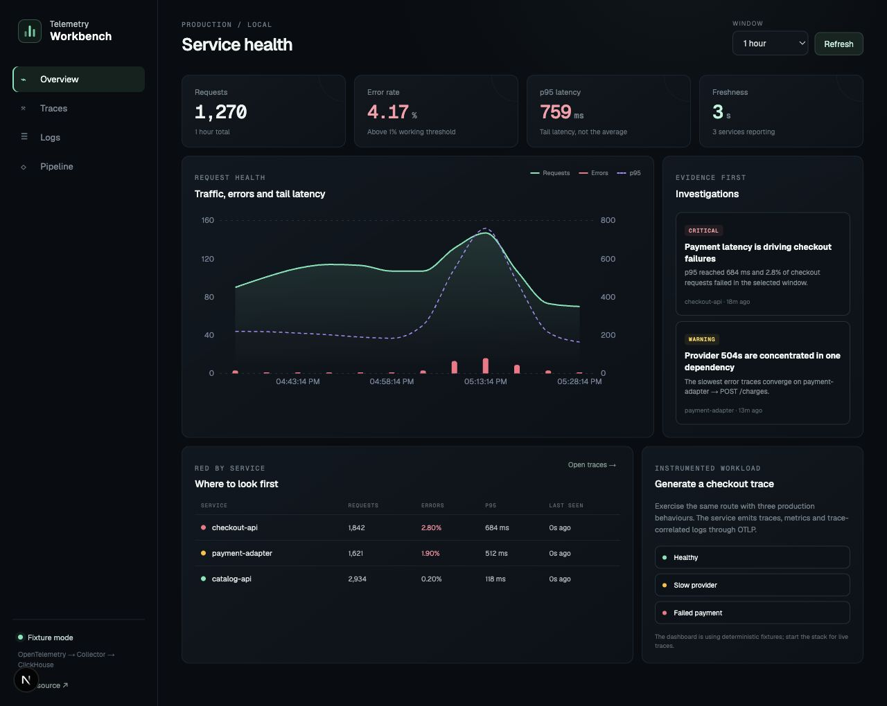

# Telemetry Workbench

A small, end-to-end observability system built to answer one practical question:

> A checkout is failing. Which service is responsible, what happened inside one
> request, and which logs prove it?

The project accepts OpenTelemetry traces, metrics and logs through the Collector,
stores them in ClickHouse, and exposes a focused React/Next.js investigation UI.
It includes an instrumented Node.js checkout workload that can produce healthy,
slow and failed requests on demand.

This does not claim production parity with a commercial observability platform.
It is a working study of the most important observability
boundaries: portable OTLP instrumentation, Collector backpressure and redaction,
append-heavy analytical storage, bounded queries, data freshness, tail latency,
and cross-signal correlation.



## What is implemented

- OTLP/HTTP and OTLP/gRPC ingestion through the OpenTelemetry Collector
- traces, metrics and logs exported to ClickHouse
- disk-backed Collector sending queue with retry and bounded memory
- Collector-side normalization and sensitive-attribute redaction
- RED service health: request rate, errors and p95 latency
- trace search with service, status and free-text filters
- trace waterfall with parent/child timing
- logs correlated back to a trace and span
- explicit data freshness so "accepted" is not confused with "queryable"
- deterministic fixture mode for reviewing the UI without infrastructure
- an instrumented Fastify checkout service with realistic failure modes
- query-budget, correlation and fixture tests
- architecture and failure-drill documentation

## Quick review without Docker

```bash
npm install
npm run dev
```

Open [http://localhost:3000](http://localhost:3000). Fixture mode is the default;
it contains a coherent payment-provider incident and correlated evidence.

## Run the complete data path

Docker is required for ClickHouse and the Collector:

```bash
cp .env.example .env
npm install
npm run infra:up
DATA_MODE=clickhouse npm run dev
```

Then use **Generate a checkout trace** in the dashboard. Collector batches flush
within two seconds in the demo configuration.

| Component | Address |
| --- | --- |
| Dashboard | `http://localhost:3000` |
| Instrumented checkout service | `http://localhost:4000` |
| OTLP/HTTP | `http://localhost:4318` |
| OTLP/gRPC | `localhost:4317` |
| Collector metrics | `http://localhost:8888/metrics` |
| ClickHouse HTTP | `http://localhost:8123` |

## Investigation flow

1. Start on service health and look at errors and tail latency—not averages alone.
2. Open an investigation to pre-filter the traces that support it.
3. Select a trace and inspect the span waterfall to locate the slow dependency.
4. Read only logs carrying the same trace context to confirm the failure mode.
5. Check freshness before concluding that an apparent recovery is real.

## Why these tools

**OpenTelemetry** keeps application instrumentation portable. The application
exports OTLP and does not know which storage engine or observability vendor is
downstream.

**The Collector** centralizes transport concerns: receiving, memory limits,
resource normalization, redaction, batching, retries and a persistent queue.
Production would add replicated durability and stricter tenant isolation; the
demo does not hide that gap.

**ClickHouse** matches append-heavy telemetry and time-bounded analytical scans.
The official Collector exporter creates signal-specific tables and batches rows
for efficient MergeTree inserts. Product state such as users, permissions and
alert policies would belong in a transactional control plane instead.

**Next.js and React** provide the operator workflow. The UI deliberately connects
signals rather than exposing unrelated logs, metrics and traces tabs.

## Verification

```bash
npm run typecheck
npm test
npm run build
```

See [Architecture](docs/ARCHITECTURE.md) for boundaries and deliberate omissions,
and [Operations](docs/OPERATIONS.md) for traffic generation and an outage drill.

For local verification on macOS without Docker, a native Collector configuration
is included at `infra/otel/collector.local.yaml`.

## Honest limits

This repository is a demonstrator, not a hosted observability company. It does
not implement authentication, multi-tenant authorization, a replicated stream,
long-term retention, alert delivery, tail sampling or multi-region failover.
Those omissions are the next system-design questions, not implied features.

## Sources behind the implementation

- [OpenTelemetry JavaScript](https://opentelemetry.io/docs/languages/js/)
- [OTLP exporter configuration](https://opentelemetry.io/docs/languages/sdk-configuration/otlp-exporter/)
- [OpenTelemetry Collector](https://opentelemetry.io/docs/collector/)
- [Collector ClickHouse exporter](https://github.com/open-telemetry/opentelemetry-collector-contrib/tree/main/exporter/clickhouseexporter)
- [Official ClickHouse JavaScript client](https://github.com/ClickHouse/clickhouse-js)
- [ClickHouse guidance for OpenTelemetry storage](https://clickhouse.com/resources/engineering/best-resources-storing-opentelemetry-collector-data)

## License

MIT
